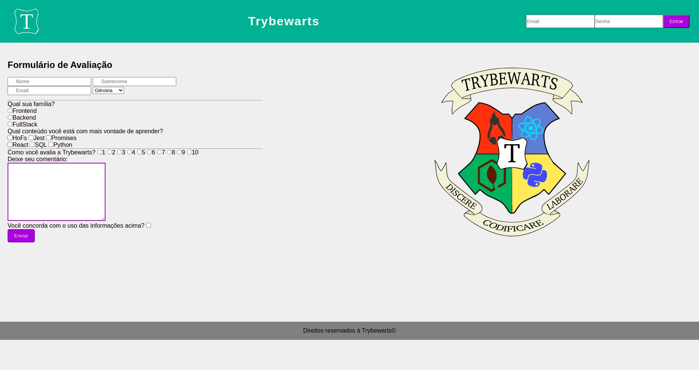

## Project 4 - Fundamentals Module - Trybewarts

---

# Skills and technologies used in this project:

* _HTML 5 
* _CSS 3 
* _JavaScript 

---

## What is the project about?

This project was made to train flexbox CSS.
Project under development.

---

# Instructions for running the project:

1. Clone the repository
  * `git clone git@github.com:CrisSouzaMA/trybetodolist.git`
  * Entre na pasta do repositório que você acabou de clonar:
    * `cd Projeto-4-TRYBEWARTS`

2. Initialize the project
    * `npm start` (a new page should open in your browser with the project)

---

### To-do List:

- [ ] Refactor
- [ ] Responsiveness
- [ ] Improve css

Bye 🖐️

